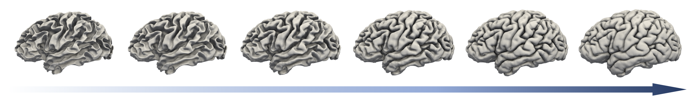
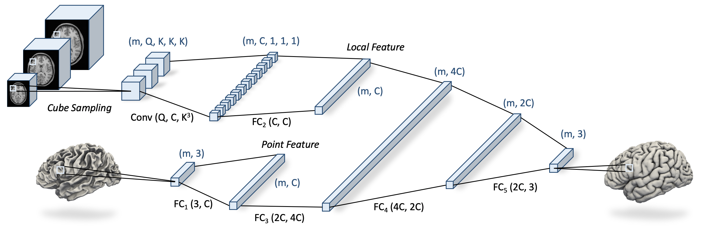
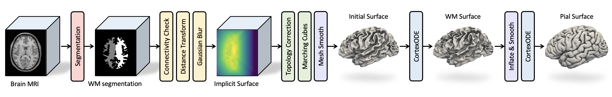

# CortexODE: Learning Cortical Surface Reconstruction by Neural ODEs




This is the official PyTorch implementation of the paper:

[CortexODE: Learning Cortical Surface Reconstruction by Neural ODEs](https://arxiv.org/abs/2202.08329)

Qiang Ma, Liu Li, Emma C. Robinson, Bernhard Kainz, Daniel Rueckert, Amir Alansary

## Overview
CortexODE leverages [Neural Ordinary Different Equations](https://arxiv.org/abs/1806.07366) (ODEs) to learn diffeomorphic flows for cortical surface reconstruction. The trajectories of the points on the surface are modeled as ODEs, where the derivatives of their coordinates are parameterized via a learnable Lipschitz-continuous *deformation network*. This provides theoretical guarantees for the prevention of surface self-intersections.



CortexODE is integrated to an automatic learning-based pipeline. The pipeline utilizes a 3D U-Net to predict a white matter (WM) segmentation from brain MRI scans, and further generates a signed distance function (SDF) that represents an initial surface. Fast [topology correction](https://doi.org/10.1016/j.cmpb.2007.08.006) is used to guarantee the genus-0 topology. After isosurface extraction, two deformation networks are trained to deform the initial surface to white matter and pial surfaces respectively. 



## Installation
This implementation mainly relies on [PyTorch](https://pytorch.org/), [PyTorch3D](https://pytorch3d.org/) and [torchdiffeq](https://github.com/rtqichen/torchdiffeq) libraries. The dependencies can installed by running the following codes:
```
conda create --name cortexode
source activate cortexode
pip install -r requirements.txt
```
In addition, the [PyTorch3D](https://github.com/facebookresearch/pytorch3d/blob/main/INSTALL.md) library (v0.4.0) should be installed manually.

## Dataset
CortexODE is validated on the [ADNI](https://adni.loni.usc.edu/), [HCP Young Adult](https://www.humanconnectome.org/study/hcp-young-adult) and [dHCP (3rd Release)](http://www.developingconnectome.org/data-release/third-data-release/) dataset. The data splits for training/validation/testing are given in ```./data/split```. For the ADNI and HCP datasets, the data should be in FreeSurfer format. We have provided an example data in ```./data/adni/test/subject_1```. 

For a new dataset, please revise ```./data/preprocess.py``` to make sure the cortical surfaces match the MRI volume. For the data aligned to MNI-152 space, we recommend to use ```data_name='adni'``` with minor modification.


## Evaluation
We have provided the pretrained models in ```./ckpts/pretrained``` for all datasets. To predict the cortical surfaces for the example ADNI data using pretrained models, please run

``` bash
python eval.py --test_type='pred' --data_dir='./data/adni/test/' --model_dir='./ckpts/pretrained/adni/' --result_dir='./ckpts/experiment_1/result/' --data_name='adni' --surf_hemi='lh' --tag='pretrained' --solver='euler' --step_size=0.1 --device='gpu'
```

```--data_dir``` is the path of the dataset. ```--model_dir``` is the path of saved models. ```--result_dir``` is the path to save the predicted surfaces (obj / stl / FreeSurfer format). Please refer to ```config.py``` for detailed configurations. To evaluate the ASSD, HD and self-intersections, please use

``` bash
python eval.py --test_type='eval' --data_dir='./data/adni/test/' --model_dir='./ckpts/pretrained/adni/' --data_name='adni' --surf_hemi='lh' --tag='pretrained' --solver='euler' --step_size=0.1 --device='gpu'
```
The [torch-mesh-isect](https://github.com/vchoutas/torch-mesh-isect) package should be installed to detect the mesh self-intersections.


## Training
The training of CortexODE models consists of segmentation, initial surface generation, and cortical surface reconstruction. The following instruction shows how to train CortexODE models on the ADNI dataset on left brain hemisphere.

### Segmentation
For WM segmentation, please run the following code to train a 3D U-Net for 200 epochs:

``` bash
python train.py --train_type='seg' --data_dir='./data/adni/' --model_dir='./ckpts/experiment_1/model/' --data_name='adni' --n_epoch=200 --tag='exp1' --device='gpu'
```
where ```--model_dir``` is the path to save the model checkpoints. ```experiment_1``` and ```--tag='exp1'``` are the identity of the experiment. 


### Initial Surface Generation
After training the WM segmentation, select the model with the best validation Dice score and run the following codes to create initial surfaces for both training and validation sets:

``` bash
python eval.py --test_type='init' --data_dir='./data/adni/train/' --model_dir='./ckpts/experiment_1/model/' --init_dir='./ckpts/experiment_1/init/train/' --data_name='adni' --surf_hemi='lh' --tag='exp1' --device='gpu'
```
``` bash
python eval.py --test_type='init' --data_dir='./data/adni/valid/' --model_dir='./ckpts/experiment_1/model/'  --init_dir='./ckpts/experiment_1/init/valid/' --data_name='adni' --surf_hemi='lh' --tag='exp1' --device='gpu'
```
where ```--init_dir``` is the path to save the initial surfaces.

### Cortical Surface Reconstruction
We train two deformation networks for WM and pial surface reconstruction. We use the *adjoint sensitivity method* proposed in [Neural ODEs](https://github.com/rtqichen/torchdiffeq) to train our models with constant GPU memory cost. To train CortexODE for WM surface reconstruction using Euler solver with step size h=0.1, you can use:

``` bash
python train.py --train_type='surf' --data_dir='./data/adni/' --model_dir='./ckpts/experiment_1/model/' --init_dir='./ckpts/experiment_1/init/' --data_name='adni'  --surf_hemi='lh' --surf_type='wm' --n_epochs=400 --n_samples=150000 --tag='exp1' --solver='euler' --step_size=0.1 --device='gpu'
```
where ```--init_dir``` is the path of the input initial surfaces, and ```--n_samples``` is the number of randomly sampled points to compute the Chamfer loss. For pial surface reconstruction, please run:
``` bash
python train.py --train_type='surf' --data_dir='./data/adni/' --model_dir='./ckpts/experiment_1/model/' --data_name='adni'  --surf_hemi='lh' --surf_type='gm' --n_epochs=400 --tag='exp1' --solver='euler' --step_size=0.1 --device='gpu'
```
Note that we use ```lr=1e-4``` as the learning rate to reduce the training time. Therefore, the curve of the validation error can highly oscillate. Please select the models with the best performance on the validation.